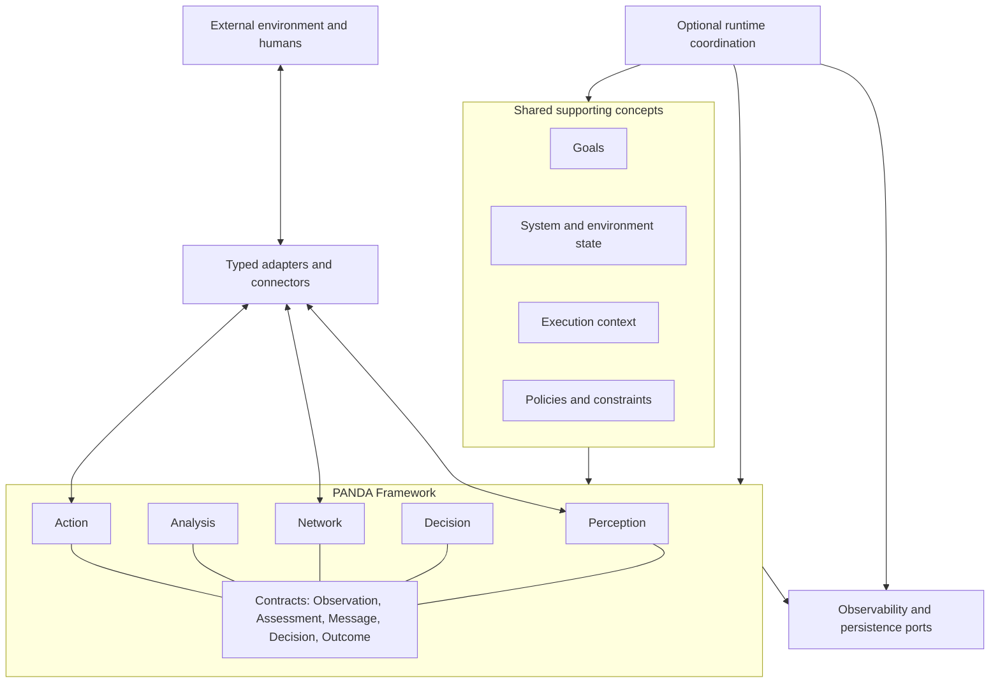
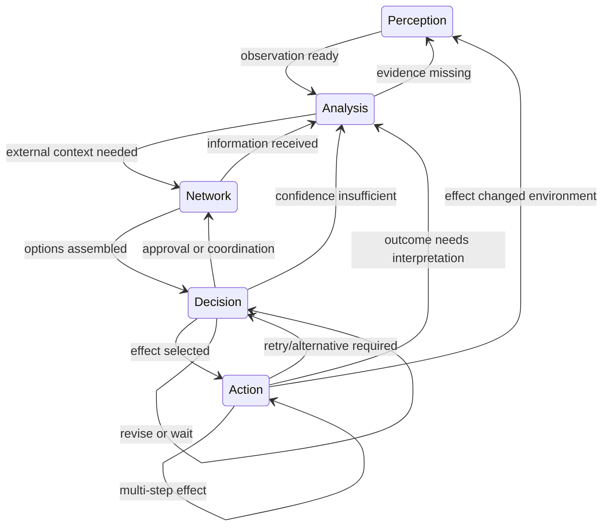
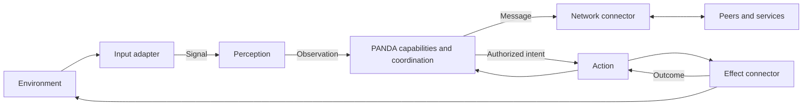

# PANDA Conceptual Architecture

**Status:** Proposed
**Audience:** framework authors, runtime authors, capability and connector implementers
**Authority:** this document defines the high-level architecture; ADRs record individual choices.

## 1. Scope and definition

PANDA is an open, model-agnostic framework for composing autonomous systems from five fundamental capabilities:

| Capability | Responsibility | Typical product |
| --- | --- | --- |
| Perception | Normalize an external signal into a trusted-enough internal representation | `Observation` |
| Analysis | Interpret observations and state; assess, infer, predict, or identify missing information | `Assessment` |
| Network | Exchange information, context, work, and capability descriptions across an addressable boundary | `Message` or received information |
| Decision | Select an intent or next course under goals, evidence, policy, and constraints | `Decision` |
| Action | Attempt an authorized effect and report what occurred | `Outcome` |

These are responsibilities, not ordered stages. Memory, planning, reflection, and understanding remain valuable techniques or implementations, but are not additional PANDA capabilities: understanding and reflection normally implement Analysis; planning normally contributes to Analysis or Decision; memory is persistence supporting every capability; execution is the runtime concern that invokes Action.

PANDA defines contracts and extension points. A **PANDA Runtime** is an optional coordinator that invokes those contracts. Applications may embed the framework and coordinate it themselves.

## 2. Architectural invariants

1. PANDA has exactly five fundamental autonomy capabilities: Perception, Analysis, Network, Decision, and Action.
2. A capability denotes responsibility, never a mandatory position in a sequence.
3. Any capability may request any policy-permitted next capability, including itself; waiting or termination may end a flow without another invocation.
4. Cross-capability communication uses explicit, versionable contracts rather than knowledge of concrete implementations.
5. Goals are first-class and intelligence mechanisms are replaceable; no LLM is required.
6. External technology and effects are isolated behind responsibility-specific adapters or connectors.
7. Durable state, believed environment state, and execution context have distinct ownership and lifetime.
8. A proposed transition or action is subject to policy before commitment or external effect.
9. Decisions, transitions, effects, outcomes, and failures are correlatable and auditable.
10. The conceptual model works in one process without a broker, daemon, database, or network service; distribution is an extension.
11. Failures are structured outcomes that may drive recovery transitions; they do not imply process failure.
12. Untrusted data remains identifiable through provenance and trust metadata until explicitly validated.

## 3. Conceptual architecture

The diagram is dependency-oriented, not a processing stack. Runtime coordination depends on framework contracts, while capability code sees ports for state, policy, persistence, connectors, and telemetry rather than a particular daemon or database.

## 4. Dynamic transition model

A `TransitionRequest` expresses source, target, reason, trigger, payload reference, context/correlation identifier, and time. A runtime validates it, evaluates policy, records the result, and either invokes the target or emits rejection/failure information. In embedded use, an application can perform the same protocol directly. A transition is therefore an explicit domain contract; events are one optional transport for it.

This is illustrative, not an allow-list. Policies may constrain transitions for a deployment.

## 5. External interaction

Input adapters decode mechanisms; Perception assigns semantic structure, provenance, time, and confidence. Network connectors carry envelopes without owning domain reasoning. Action connectors perform narrowly described effects and return outcomes. They should not be forced into one giant connector interface.

## 6. Core contracts

Contracts are immutable records where practical and contain stable IDs plus schema/type versions. Payload schemas are extension points, not untyped bags. Metadata is reserved for non-semantic annotations; fields that drive policy or behavior belong in typed contracts.

- `Signal`: raw or decoded external input plus source and receipt time.
- `Observation`: normalized claim with observation time, receipt time, source/provenance, confidence/trust, and typed payload.
- `Assessment`: interpretation, supporting evidence, confidence, assumptions, and optionally information needs or candidate options.
- `Envelope<Message>`: message ID, sender, recipient/address, correlation/causation, expiry, authenticity information, and typed content. Request, response, and broadcast are interaction patterns.
- `Decision`: selected intent, considered options (or a protected reference), reasons, evidence, applicable goals/policies, confidence, and status.
- `Outcome`: attempted intent/action, status, produced data, observed effect if known, error, start/end time, and idempotency reference.
- `Goal`: objective, priority, constraints, success/failure conditions, status, and stable ID.
- `Failure`: category, origin, retryability, cause, evidence, and correlation.
- `TransitionRequest` / `TransitionRecord`: proposed versus committed routing, including policy result.

See the focused documents for ownership and minimum fields.

## 7. Event-oriented coordination

Events are recommended as immutable facts at the runtime boundary (`ObservationCreated`, `DecisionMade`, `ActionCompleted`), because they support loose coupling, recovery, and audit. They are not the only framework API: direct invocation may be simpler for embedded deterministic systems. Commands request work; events state what happened. Treating every object as an “observation,” as the scaffold currently does, loses this distinction.

Event delivery semantics, broker choice, serialization, retention, ordering, and event sourcing are implementation decisions. A runtime must document them. Handlers should assume duplicates are possible when durable delivery is used.

## 8. Human and intelligence participation

Human, rules, optimization, state-machine, planner, ML, and LLM implementations satisfy the same capability contracts. Human participation can supply a signal (Perception), assessment (Analysis), exchange (Network), approval/selection (Decision), or performed effect (Action). Human-in-the-loop, human-on-the-loop, and fully autonomous modes differ through policy and implementations, not architecture.

## 9. Security and trust boundaries

External inputs and network messages cross trust boundaries. Connectors run with least privilege; secret references—not secret values—flow through contracts. Capability identity and message authenticity matter when crossing processes. Action is the critical effect boundary: validate intent, authorize principal and target, enforce policy/approval, constrain resources, use idempotency where possible, and audit request plus outcome. See [security.md](security.md).

## 10. Repository analysis and migration guidance

The repository is a TypeScript pnpm monorepo with CLI, daemon, dashboard, core, graph, SDK, and shared packages. No earlier architecture specification existed beyond the root README and `docs/scaffolding.md`.

### Preserve

- `PandaObservation` already carries identity, time, source, priority, confidence, correlation, payload, and metadata.
- The in-memory bus proves local-first operation and keeps brokers optional.
- Scheduler registration, action dispatch, connectors, transition history, structured action results, and correlation IDs are useful seeds.
- The daemon/SDK split hints at a runtime boundary, while `PandaRuntime` can support embedded use.
- Tests explicitly demonstrate non-adjacent transitions.

### Change or clarify before implementation matures

| Current concept | Finding | Architectural direction |
| --- | --- | --- |
| Seven `PandaStateName` values | Conflicts with the five PANDA capabilities and mixes techniques with responsibilities | Replace capability identity with the five names; model memory/persistence, planning, and reflection separately |
| `runPandaLoop` | Hard-codes Understanding → Planning → Decision → Execution → Reflection | Replace with outcome/transition-driven routing; retire “loop” terminology |
| All transition requests and completions as observations | Conflates commands, events, observations, and transitions | Keep distinct contracts even if one bus transports them |
| `PandaAnalyzer extends ObservationHandler` | Makes Analysis the generic runtime handler and omits the other capability contracts | Register typed implementations for all five capabilities |
| Single `PandaConnector` shape | Mixes observation publishing, action subscription, effect execution, and lifecycle | Split perception adapters, network transports, and action connectors; share optional lifecycle/health traits |
| `PandaSession.currentState` | Implies one global current stage and cannot represent concurrent work | Track executions, active invocations, goals, and committed transition records |
| `ObservationMemory` | Memory is a bus subscriber with hidden retention policy | Make persistence a port and retention a policy; avoid calling memory a capability |
| `ActionDispatcher` | No policy/authorization gate; successful connector result only means accepted | Gate effects and distinguish accepted, executed, verified, and failed outcomes |
| README terminology | Says PANDA while expanding to Perception/Understanding/Memory/Planning/Decision/Execution/Reflection | Align public vocabulary with the five-capability definition |
| Graph compatibility wrapper | Name suggests graph while implementing a fixed demonstration path | A graph may be one coordinator implementation, never the conceptual model |

There is currently little capability-to-capability direct coupling; the stronger coupling is semantic—shared “observation” transport and a single current state. Production source is intentionally unchanged by this architecture task.

## 11. Relationship to established architectures

- **OODA and agent loops:** useful execution patterns, but impose a recurring order. PANDA supplies reusable responsibilities and allows non-linear, terminating, concurrent, or externally resumed paths.
- **Actor systems:** identity, mailboxes, isolation, and supervision can implement capabilities; requiring every capability to be an actor would constrain embedded use.
- **Event-driven architecture:** immutable facts and asynchronous decoupling fit runtimes; PANDA does not require a broker or eventual consistency.
- **State machines:** guards and explicit transitions are useful for constrained deployments; a single global state machine poorly represents concurrent goals and dynamic implementations.
- **Workflow engines:** durability, timers, retries, and human tasks are reusable runtime ideas; predeclared workflows must remain optional.
- **Blackboard architectures:** shared knowledge and opportunistic contribution fit Analysis/Network; uncontrolled shared mutable state conflicts with ownership and audit.
- **Cognitive architectures:** memory, planning, learning, and reflection may implement capabilities; PANDA does not prescribe a theory of cognition.

## 12. Classification and unresolved questions

### Core invariants

The twelve invariants in section 2 define PANDA.

### Architectural decisions

The initial ADRs select explicit transitions, typed connector boundaries, state/context separation, framework/runtime separation, model independence, and optional event-oriented runtime coordination.

### Deferred implementation decisions

Language-level APIs, sync versus async signatures, event bus/broker, storage engine, wire formats, schema registry, delivery guarantees, concurrency scheduler, deployment topology, discovery protocol, sandbox technology, telemetry backend, and retry algorithms.

### Open questions

1. Is `Assessment` the single Analysis output name, or should prediction and information need be peer contract types?
2. Does the smallest framework expose `TransitionRequest`, or a more general `NextStep` union including wait and terminate?
3. Which goal changes require a Decision record versus administrative control-plane authorization?
4. How are conflicting concurrent decisions for shared resources arbitrated?
5. What is the minimum portable capability discovery description without creating a universal RPC schema?
6. Which records are mandatory for conformance, and what redaction rules preserve privacy?
7. Should verified environmental effect be a later Observation linked to an Outcome rather than an Outcome field?
8. What compatibility/versioning promise applies to core contracts before 1.0?

## 13. Critical architecture review

- **Fixed loop?** No. Transitions are requested from outcomes and may target any capability, self-transition, wait, or terminate.
- **Clear responsibilities?** Yes, with Analysis explaining what is happening and Decision choosing what should happen; runtime execution is not the Action capability itself.
- **Meaningful Network?** Yes. It owns exchange across addressable trust/ownership boundaries, including in-process peers; it is not TCP/IP plumbing or the internal event bus.
- **State versus context?** Yes. Durable system/environment beliefs are repository-owned; execution context is scoped propagation data.
- **Replaceability and no LLM?** Yes. Contracts describe products, not intelligence techniques.
- **Local-first?** Yes. Direct calls and in-memory implementations are conforming; distribution is optional.
- **Policy and safety?** Proposed transitions and effects are gated centrally where practical, with defense-in-depth inside connectors.
- **Premature infrastructure?** None is required. Kubernetes, Kafka, Redis, vector databases, MCP, gRPC, containers, cloud, and microservices remain optional implementation choices.
