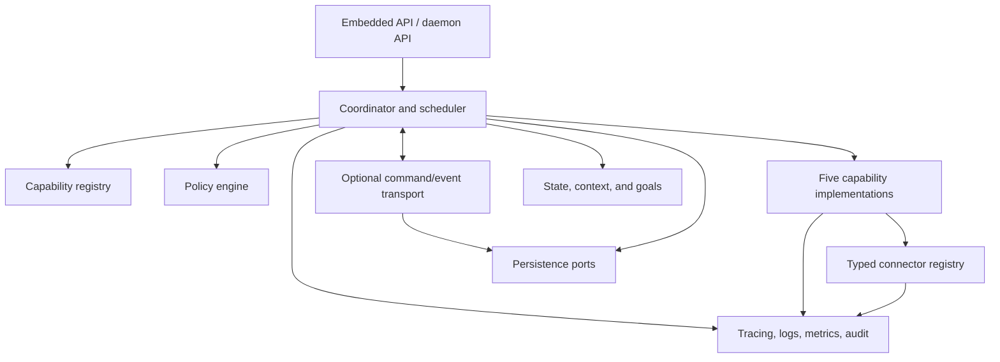

# Framework and Runtime

The **framework** defines capability and domain contracts, extension points, connector ports, policy/state/persistence ports, conformance rules, and an embeddable developer API. It does not require a daemon or own application lifecycle.

A future **runtime** may provide registration and discovery, lifecycle, routing, transition validation, context propagation, goal and state repositories, policy enforcement, scheduling, connector management, event handling, retries/timeouts, concurrency control, persistence, and observability.

The coordinator invokes; capabilities reason or transform; connectors cross external boundaries. A minimal embedded coordinator may be a few direct calls with in-memory ports. A daemon, durable scheduler, or distributed runtime is an optional implementation profile.
