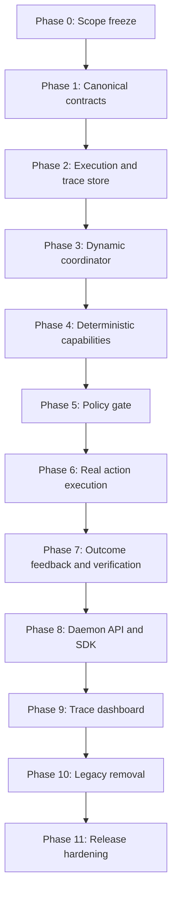

# PANDA v0.1 Implementation Plan

**Status:** Proposed implementation plan

**Progress:** Phases 0 through 11 complete. The approved product baseline is the
[PANDA v0.1 Frozen Scope Contract](v0.1-scope-contract.md), the supported release
surface is the [PANDA v0.1 Release Profile](v0.1-release-profile.md), and final
validation is recorded in the [Phase 11 Plan](plans/phase-11.md).

**Target:** PANDA v0.1

**Scope:** One safe, closed-loop, dynamically routed execution with a complete causal trace

## 1. Objective

PANDA v0.1 must demonstrate that a real observation can enter the runtime,
drive an execution dynamically through PANDA capabilities, produce and execute
an authorized action, observe the result, verify the goal, and retain a complete
inspectable reasoning trail.

The release is successful when the following flow works end to end:

```text
Observation accepted
  -> goal created
  -> route selected dynamically
  -> decision and rationale recorded
  -> action authorized
  -> real action executed
  -> effect observed
  -> goal success verified
  -> execution terminated
  -> causal trace retrievable
```

The initial demonstration uses a deterministic, sandboxed filesystem action:

```json
{
  "type": "demo.file.requested",
  "payload": {
    "path": "proof.txt",
    "content": "PANDA v0.1 completed"
  }
}
```

The expected successful route is:

```text
Perception -> Analysis -> Decision -> Action -> Perception -> Analysis -> terminate
```

Network is a registered PANDA capability but does not need to be invoked by
this scenario. PANDA capabilities are selectable responsibilities, not stages
that every execution must visit.

## 2. Implementation principles

1. Keep every phase buildable and testable on its own.
2. Introduce the new model additively before deleting legacy types or behavior.
3. Establish execution identity and tracing before adding dynamic coordination.
4. Establish policy enforcement before enabling real external effects.
5. Treat action dispatch, action execution, and effect verification as distinct
   outcomes.
6. Keep scenario-specific logic inside capability implementations, not the
   coordinator.
7. Use structured evidence and decision rationale as the reasoning trail. PANDA
   does not claim to expose hidden model chain-of-thought.
8. Keep v0.1 deterministic and model-independent; an LLM is not required.

## 3. Dependency order



The phases should be merged in this order. In particular, real filesystem
writes must not be enabled before the policy gate, and the legacy seven-state
model must not be removed until all callers use the new execution model.

## 4. Phase 0: Freeze the v0.1 contract

**Dependencies:** None

**Status:** Complete — frozen in
[PANDA v0.1 Frozen Scope Contract](v0.1-scope-contract.md)

### Deliverables

- Confirm the five canonical capabilities: `perception`, `analysis`, `network`,
  `decision`, and `action`.
- Confirm the sandboxed filesystem golden path.
- Define the valid-input, missing-information, policy-denial, connector-failure,
  and verification-failure scenarios.
- Define the sandbox root and allowed filesystem operation.
- Define the required trace record categories and fields.
- Document that the initial execution store is in-memory and not restart-safe.
- Freeze the success and failure criteria used by the release tests.

### Exit gate

- The v0.1 scenario, routes, success criteria, and non-goals are documented.
- The expected end-to-end tests can be written without further product-level
  decisions.
- No production behavior needs to change in this phase.

## 5. Phase 1: Introduce canonical contracts additively

**Dependencies:** Phase 0

**Status:** Complete — recorded in the [Phase 1 Plan](plans/phase-1.md)

### Deliverables

Add the new contracts without removing `PandaStateName` or changing the current
application path:

- `PandaCapability`
- `ExecutionContext`
- `Goal`
- `PandaExecution`
- `Signal`
- `Observation`
- `Assessment`
- `Decision`
- `ActionRequest`
- `Outcome`
- `Failure`
- `NextStep`
- `TransitionRequest`
- `TransitionRecord`
- `TraceRecord`

The minimum next-step contract is:

```ts
type NextStep =
  | {
      kind: "invoke";
      target: PandaCapability;
      reason: string;
      payloadRef?: string;
    }
  | { kind: "wait"; reason: string; resumeOn?: string }
  | {
      kind: "terminate";
      outcome: "succeeded" | "failed" | "cancelled";
      reason: string;
    };
```

Every material contract must include or inherit:

- stable `id`;
- `schemaVersion`;
- `executionId`;
- `goalId`;
- `correlationId`;
- optional `causationId`;
- producer or originating capability;
- timestamp;
- typed payload or typed result fields.

### Exit gate

- Existing production behavior still builds and passes its tests.
- Unit tests validate record creation, identity, schema version, correlation,
  causation, and timestamps.
- New capability contracts do not use legacy seven-state terminology.

## 6. Phase 2: Build the execution and trace foundation

**Dependencies:** Phase 1

**Status:** Complete — recorded in the [Phase 2 Plan](plans/phase-2.md)

### Deliverables

- Add an `ExecutionStore` port and an in-memory implementation.
- Create, retrieve, update, and list executions.
- Append and retrieve trace records by execution ID.
- Track status and active capability per execution rather than through a
  process-wide current state.
- Assign a monotonic sequence number to each execution's trace records.
- Validate that causation links point to records in the same execution.
- Keep trace records append-only.

Implemented port shape:

```ts
type StoredTraceRecord<TPayload = unknown> = TraceRecord<TPayload> & {
  sequence: number;
};

interface ExecutionStore {
  createExecution(execution: PandaExecution): PandaExecution;
  getExecution(id: string): PandaExecution | undefined;
  listExecutions(): PandaExecution[];
  updateExecution(execution: PandaExecution): PandaExecution;
  appendTrace<TPayload>(
    record: TraceRecord<TPayload>,
  ): StoredTraceRecord<TPayload>;
  getTrace(executionId: string): StoredTraceRecord[];
}
```

### Exit gate

- Two concurrent executions retain independent state and trace history.
- A trace can be traversed from its root signal or observation to its latest
  record.
- Invalid cross-execution causation is rejected.
- Tests cover missing execution IDs, sequence ordering, and append-only
  behavior.

## 7. Phase 3: Add the dynamic coordinator

**Dependencies:** Phases 1 and 2

**Status:** Complete — recorded in the [Phase 3 Plan](plans/phase-3.md)

### Deliverables

- Add a `CapabilityRegistry` for independently registered implementations.
- Add an execution-scoped coordinator that invokes the selected capability.
- Accept a capability result and its proposed `NextStep`.
- Validate and record every requested and committed transition.
- Support `invoke`, `wait`, and `terminate` next steps.
- Support self-transitions and non-adjacent transitions.
- Convert invocation errors into structured failures.
- Enforce an invocation limit, deadline, and cancellation signal.
- Reject unknown capabilities and stale execution state.

The coordinator must not encode a sequence of capability calls. Its control
logic should be equivalent to:

```ts
while (!execution.terminal) {
  const result = await registry.invoke(nextStep.target, context, input);
  nextStep = result.nextStep;
  await coordinator.commit(nextStep);
}
```

### Exit gate

- Test capabilities can route to any registered capability.
- Self-transition, wait, termination, and unknown-target behavior are tested.
- An unbounded transition sequence stops at the configured invocation limit.
- Every invocation and transition appears in the execution trace.
- No scenario-specific routing exists in the coordinator.

## 8. Phase 4: Implement deterministic PANDA capabilities

**Dependencies:** Phase 3

**Status:** Complete — recorded in the [Phase 4 Plan](plans/phase-4.md)

### Perception

- Validate the input signal.
- Normalize valid input into an observation.
- Preserve source, occurrence/receipt time, and provenance.
- Route complete input to Analysis.
- Represent missing or invalid information without inventing values.

### Analysis

- Determine whether the requested path and content are present and valid.
- Produce an assessment with evidence, assumptions, confidence, and information
  needs.
- Route complete input to Decision.
- Route incomplete input to Perception/wait for more information.

### Decision

- Generate the relevant options: sandboxed write or no action/clarification.
- Record the selected option, relevant alternatives, decisive evidence, and
  rationale.
- Produce an action intent only when evidence is sufficient.
- Route an authorized candidate to Action.

### Network

- Register a conforming placeholder or minimal implementation.
- Do not force the filesystem scenario to invoke Network.

### Exit gate

- Complete and incomplete requests produce different transition sequences.
- Incomplete input produces no action request.
- Decision records include evidence, relevant alternatives, and rationale.
- The dynamic routes are selected by capability outputs, not coordinator
  position.

## 9. Phase 5: Add the policy gate

**Dependencies:** Phases 1 through 4

**Safety requirement:** Must complete before Phase 6 enables filesystem writes

**Status:** Complete — recorded in the [Phase 5 Plan](plans/phase-5.md)

### Deliverables

- Add a policy port with `allow`, `deny`, and optionally `require` results.
- Evaluate policy when committing transitions and immediately before effects.
- Restrict v0.1 actions to `filesystem.write` through the filesystem connector.
- Restrict paths to an execution-specific sandbox.
- Reject absolute paths, traversal through `..`, and symlink escapes.
- Apply a maximum content size.
- Record the policy ID, result, inputs, and reason in the trace.
- Convert a denial into a structured outcome that Decision can evaluate.

### Exit gate

- Allowed actions receive an auditable policy result.
- Denied actions never reach the connector.
- Tests cover absolute paths, traversal, symlink escape, unsupported actions,
  and oversized content.
- Policy denial is visible in the trace and is never represented as success.

## 10. Phase 6: Implement real action execution

**Dependencies:** Phase 5

**Status:** Complete — recorded in the [Phase 6 Plan](plans/phase-6.md)

### Deliverables

- Replace the filesystem connector's simulated `{ accepted: true }` response
  with a real write inside an execution sandbox.
- Use an execution-specific directory such as:

  ```text
  .panda/runs/<executionId>/workspace/proof.txt
  ```

- Return a structured outcome that distinguishes success, failure, rejection,
  cancellation, timeout, and indeterminate status where applicable.
- Record start and end times, resolved sandbox path, byte count, and content
  hash.
- Preserve action, execution, correlation, and causation identities.
- Report known partial effects rather than converting them to success.

### Exit gate

- An integration test verifies that the file physically exists.
- The resulting content and hash match the requested value.
- Connector and unsupported-action failures become structured outcomes.
- Tests write only to temporary or execution-specific sandbox directories.

## 11. Phase 7: Close the outcome feedback loop

**Dependencies:** Phase 6

**Status:** Complete — recorded in the [Phase 7 Plan](plans/phase-7.md)

### Deliverables

- Publish or return the action outcome as input for continued coordination.
- Route a successful action outcome to Perception.
- Observe the resulting file independently of the dispatch result.
- Route the resulting observation to Analysis.
- Compare the observed path, contents, and hash with the goal's success
  criteria.
- Terminate successfully only after verification passes.
- Route a mismatch or action failure to Decision for a bounded recovery choice,
  or terminate explicitly when no safe recovery is available.

### Exit gate

- Successful dispatch without a matching environmental effect does not achieve
  the goal.
- Correct file contents produce verified goal success.
- Missing or incorrect contents produce a failure or recovery decision.
- Outcome, verification observation, assessment, and terminal status have valid
  causation links.

## 12. Phase 8: Integrate the daemon and SDK

**Dependencies:** Phases 2 through 7

**Status:** Complete — recorded in the [Phase 8 Plan](plans/phase-8.md)

### Deliverables

- Make the daemon own the coordinator, registry, policy engine, connector
  registry, and execution store.
- Remove the split behavior where the daemon observes through one runtime while
  `runPandaLoop` constructs another.
- Add the following API surface:

  ```text
  POST /executions
  GET  /executions
  GET  /executions/:id
  GET  /executions/:id/trace
  WS   /events
  ```

- Return the execution ID, status, outcome, verification result, and trace URL
  from execution creation.
- Add typed SDK methods for the execution and trace endpoints.
- Temporarily route `/runs` through the new execution API if compatibility is
  required.
- Stream material execution records through the existing WebSocket channel.

### Exit gate

- An API-created execution reaches the correct terminal state.
- The API trace matches the execution store.
- WebSocket clients receive material execution events.
- Concurrent API executions remain isolated.
- Invalid input produces a structured client error rather than an internal
  server failure.

## 13. Phase 9: Add the trace dashboard

**Dependencies:** Phase 8

**Status:** Complete — recorded in the [Phase 9 Plan](plans/phase-9.md)

### Deliverables

- List executions and their current or terminal status.
- Display the active capability, goal, and success criteria.
- Render a chronological, sequence-stable causal timeline.
- Support expandable payloads for:
  - observations;
  - capability invocations;
  - assessments;
  - decisions;
  - transitions;
  - policy evaluations;
  - actions;
  - outcomes;
  - verification;
  - termination and failures.
- Show the direct cause of every material record.
- Clearly distinguish observed facts, deterministic inference, decisions,
  external effects, and failures.

### Exit gate

The dashboard allows an operator to determine:

- what entered the system;
- which route the execution followed;
- why the action was selected;
- whether it was authorized;
- what was executed;
- what actually occurred;
- why the goal was considered achieved or failed.

The dashboard renders stored records and does not invent missing rationale.

## 14. Phase 10: Remove the legacy execution model

**Dependencies:** Phases 3 through 9

### Deliverables

- Remove `runPandaLoop` and its predetermined transition sequence.
- Remove or rename the graph package if its remaining behavior does not
  represent a graph coordinator.
- Remove the legacy `PandaStateName` union.
- Remove session-level global `currentState` as the execution model.
- Replace the seven scaffold state names with the five canonical capabilities.
- Keep memory as persistence and planning/reflection/understanding as techniques
  used within capabilities, not capabilities themselves.
- Update the README, SDK examples, basic example, scaffolding notes, and API
  documentation.
- Remove `/runs` or mark it explicitly as deprecated.

### Exit gate

- Production searches find no legacy seven-state routing.
- All examples use the execution coordinator.
- The build, typecheck, unit tests, integration tests, and end-to-end tests pass.

## 15. Phase 11: Release hardening

**Dependencies:** All earlier phases

### Required end-to-end tests

1. Successful sandboxed filesystem execution.
2. Missing-information wait path with no action.
3. Policy-denied path with no connector invocation.
4. Connector-failure path routed back to Decision or explicit termination.
5. Verification-failure path that does not mark the goal achieved.
6. Invocation-limit termination.
7. Concurrent execution isolation.
8. Complete correlation and causation-chain reconstruction.

### Documentation and release work

- Document in-memory durability and restart behavior.
- Document the filesystem sandbox boundary and limitations.
- List supported capabilities, actions, statuses, and trace records.
- List explicitly unsupported production features.
- Record which framework requirements v0.1 implements, delegates, or does not
  support.
- Confirm clean install, build, typecheck, test, daemon, SDK, and dashboard
  workflows.

### Final release gate

PANDA v0.1 is complete only when an automated test proves all of the following
in a single execution:

```text
observation accepted
  -> goal created
  -> path selected dynamically
  -> decision explained
  -> policy evaluated
  -> real action executed
  -> effect independently observed
  -> success criteria verified
  -> execution terminated
  -> complete causal trace retrieved
```

## 16. Explicit non-goals

The following work must not block v0.1:

- LLM integration;
- Redis, Kafka, NATS, or another durable broker;
- distributed execution;
- multi-agent collaboration;
- vector memory;
- plugin marketplace or MCP support;
- real GitHub mutations;
- production authentication and authorization;
- cloud deployment or synchronization;
- general-purpose planning;
- unbounded or production-grade retry orchestration;
- production durability across daemon restarts.

## 17. Suggested delivery structure

Use one pull request per phase where practical. Phases 5, 6, and 7 should remain
separate, tightly ordered changes so that safety enforcement is reviewable
before real effects and effect verification is reviewable independently.

Every pull request should:

- identify its prerequisite phase;
- preserve a green build and test suite;
- add tests for its own exit gate;
- avoid unrelated refactoring;
- update this plan if an accepted design decision changes dependencies or
  scope.
